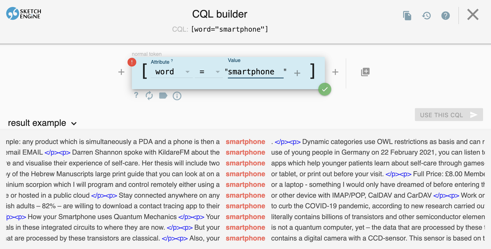
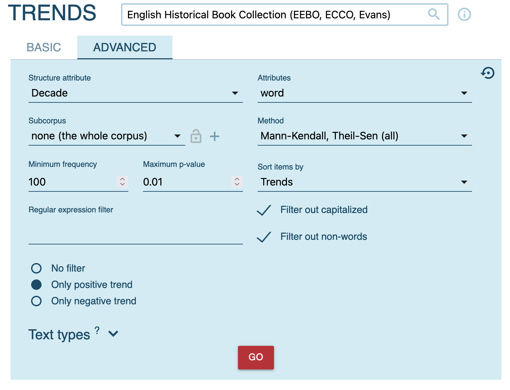

- organisation
  collapsed:: true
	- registration
		- open issues?
	- requirements
		- {{embed [[requirements]]}}
			-
- [[Sketch Engine]]
	- tutorial: [((661fc639-0d3c-4679-9b37-906063c34cb7))]
	- [[practice]]
	  id:: 6447bb36-3911-4021-9189-797e35ab5c8b
		- [[concordance]]
		  id:: 661fc637-7dc7-4926-963a-18c6a370ec38
			- in the [[enTenTen21]] corpus
				- search for attestations of the word *smartphone*
					- 
				- search for attestations of the pattern `ADJ + SMARTPHONE` (i.e. the [lemmatized]([[lemmatization]]) [[word type]]; e.g. *new smartphone*, *old smartphones*)
					- 
				- search for attestations of the pattern `TAKE a LOOK` (e.g. *take a look*, *takes a look*)
					- 
		- [[frequency]] analysis
			- in the [[enTenTen21]] corpus, identify the most common adjectives in the pattern `ADJ SMARTPHONE`
			- in the [[English Historical Book Collection (EEBO, ECCO, Evans)]] corpus
				- identify which words have exhibited the highest increase in usage frequency by using the `Trends` feature
					- 
				- note that the trends feature is also available for more recent data with the [[English Trends (2014–today)]] corpus
					- 
				- get an overview of the frequency increase of the word which has shown the most positive trend
					- 